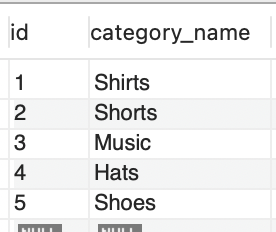
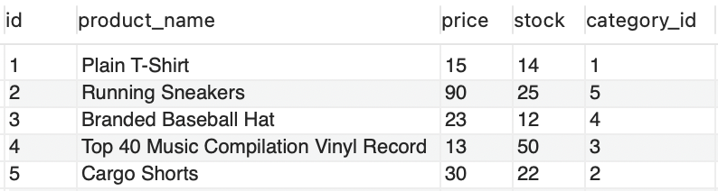
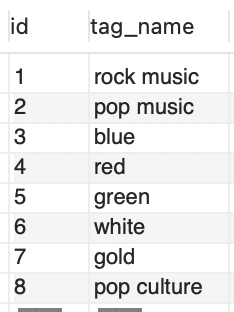
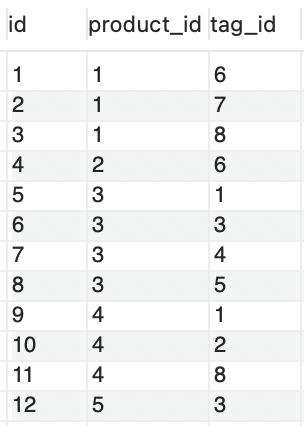
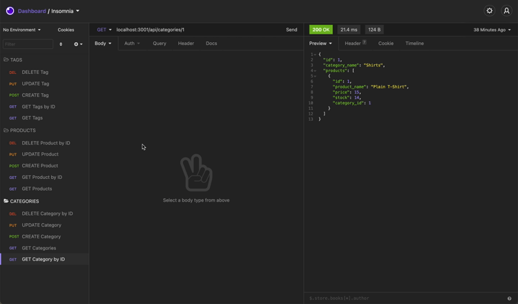

# eCommerce-Server
A back-end application that focus on object relational mapping

## How does it work?

This is a complete back-end application that is able to manipulate database information from a local server. The code allows to view this data is JSON format which could later be used for a full-stack application

Video Demo: [Video Demo](https://www.youtube.com/watch?v=cXfBzAWP_pw)

## Why make this?
The focus of this project was to create a mini eCommerce database which simulates an online store without doing much front-end.

## My goal
I wanted to focus on using more API's such as sequelize instead of writing raw SQL. I also managed to protect my credentials using the dotenv package from NPM.

## Running the application

First you will have to navigate to the database directory which will contain the schema information which can be run in raw SQL. After creating the database, you will need to add a '.env' file and install all the NPM packages stated in the package.json file. Then open up the terminal and run 'npm start' which will initiate the server and create the tables. You can seed the database by running 'npm run seed' in the terminal. After the server is up and running will can use your insomnia to edit the database information.

## Tables

This is how your databse information should look like after the intial setup  
### Category
  

### Product
  

### Tag
  

### Product Tag
  

## Insomnia 

This is an example of some of the requests  

## End note
I hope you enjoyed going through my application and hopefully you will be able edit your own eCommerce Server 👍
